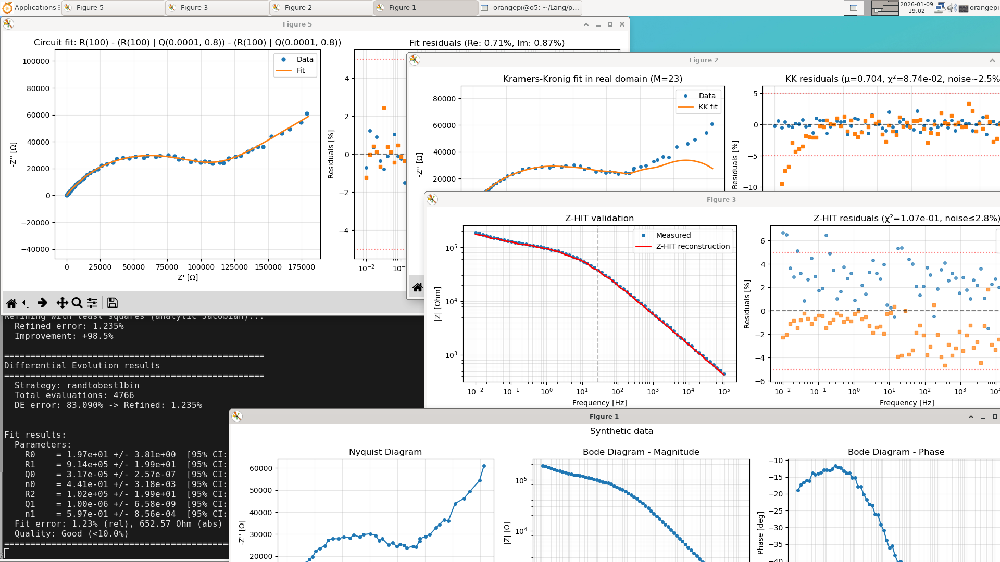

# EIS Analysis Toolkit

Modular toolkit for electrochemical impedance spectroscopy (EIS) analysis with Distribution of Relaxation Times (DRT) support.

**Key features:**

- **Reproducibility** - Objective, data-driven parameter selection
- **Modularity** - Usable as CLI and Python library
- **Advanced optimization** - Multi-start, Differential Evolution

**Example output:**



**Supported data formats:**

- **Gamry DTA** - native format (automatic metadata parsing, ZCURVE block)
- **CSV** - three columns with a header row, e.g. `frequency`, `Z_real`, `Z_imag`
  - Column names are matched case-insensitively against: frequency -
    `freq`, `frequency`, `f`, `hz`; real part - `zreal`, `z_real`, `z'`,
    `re(z)`, `real`, `z.real`, `re`; imaginary part - `zimag`, `z_imag`,
    `z''`, `im(z)`, `imag`, `z.imag`, `im`
  - If no name matches, the first three columns are used positionally
    (with a warning)
  - Delimiter: comma, semicolon, or tab (auto-detection)
  - Decimal format: US (dot) and European (comma for semicolon-delimited)
  - Comments: lines starting with `#` are ignored
  - Examples: [example/example_eis_data.csv](example/example_eis_data.csv)

**Changelog:** [CHANGELOG.md](CHANGELOG.md)

---

## Quick start

### Installation

Requires Python 3.9 or newer.

```bash
git clone https://github.com/chmelat/eis_analysis
cd eis_analysis
pip install -e .
```

After installation, the `eis` command is available system-wide.

**Windows users:** Python and Git are not preinstalled on Windows - see the step-by-step guide in [Installation on Windows](#installation-on-windows).

For alternative installation methods, see [Installation options](#installation-options).

### Basic usage

```bash
# Basic analysis (KK + Z-HIT validation + DRT)
eis data.DTA

# With circuit fitting
eis data.DTA --circuit "R(100) - (R(5000) | C(1e-6))"

# Save plots to files
eis data.DTA --save results --format pdf
```

Run `eis --help` for all options.

---

## Common workflows

### Data quality check

```bash
# KK + Z-HIT validation + DRT analysis (default)
eis data.DTA
```

Output: Kramers-Kronig residuals, mu metric, Z-HIT reconstruction, DRT spectrum with detected peaks.

### Circuit fitting

```bash
# Fit equivalent circuit
eis data.DTA --circuit "R(100) - (R(5000) | C(1e-6))"

# Use Differential Evolution for global optimization (default)
eis data.DTA --circuit "R(100) - (R(5000) | Q(1e-6, 0.9))"

# Use multi-start for local optimization
eis data.DTA --circuit "..." --optimizer multistart --multistart 20
```

### Comparing candidate circuits

Repeat `--circuit` to fit several candidates on the same data and rank them
by information criteria:

```bash
eis data.DTA \
  --circuit "R(100) - (R(5000) | C(1e-6))" \
  --circuit "R(100) - (R(5000) | Q(1e-6, 0.9))" \
  --circuit "R(100) - (R(5000) | Q(1e-6, 0.9)) - (R(100) | C(1e-5))"
```

```
Circuit comparison (n = 160 residuals, weighting = modulus)
  rank  -c  Circuit                                  k    err%     dAIC     dBIC      cond
     1   1  R(10)-(R(200)|C(2e-5))                   3    2.38      2.4      0.0   1.2e+00
     2   3  R(10)-(R(150)|C(2e-5))-(R(50)|C(1e-6))   5    2.33      0.0      3.7   1.3e+08
     3   2  R(10)-(R(200)|Q(2e-5,0.9))               4    2.38      4.4      5.1   6.0e+01

  dAIC/dBIC < 2: indistinguishable, 4-7: noticeable, > 10: decisive

Selected by BIC: R(10)-(R(200)|C(2e-5))  (candidate 1)
```

Adding an element almost always lowers the residual, so the fit error alone
cannot tell a real improvement from fitting the noise. AIC and BIC charge for
each free parameter `k` and answer the question the error cannot: does the
data support the extra element?

Only *differences* are meaningful - below 2 the models are indistinguishable,
4-7 is a noticeable difference, above 10 is decisive. BIC charges `ln(n)` per
parameter against AIC's 2, so it penalizes complexity roughly 2.5x harder and
is what selects the reported winner. The example above is the case they
disagree on: the two-branch circuit has the *lowest* residual and wins on AIC,
but BIC rejects the extra branch - and its condition number, eight orders
higher, shows why. The `!` flag marks `cond > 1e10`, where the covariance is
numerically unusable; below it, read the column anyway.

`rank` orders by BIC; `-c` is the position on the command line, which is also
the number the figures are saved under (`<prefix>_fit_1`, `_fit_2`, ...).

Values are comparable only within one run: change the weighting or the
frequency range between candidates and the comparison is meaningless.

The BIC winner is what `--analyze-oxide` receives, and which circuit that was
is written to the log. A candidate that fails to fit is reported in the table
and skipped rather than ending the run.

**Detailed documentation:** [doc/MODEL_SELECTION_AIC_BIC.md](doc/MODEL_SELECTION_AIC_BIC.md)
- what the criteria measure, a worked example of the arithmetic, and what they
cannot tell you.

### Automatic circuit suggestion

```bash
# Automatic Voigt chain fitting
eis data.DTA --voigt-chain

# With automatic element count optimization
eis data.DTA --voigt-chain --voigt-auto-M
```

### Oxide layer analysis

```bash
# Thickness calculation from capacitance
eis data.DTA --circuit "R(100) - (R(5000) | C(1e-6))" --analyze-oxide

# With custom parameters
eis data.DTA --circuit "..." --analyze-oxide --epsilon-r 22 --area 0.5

# Inverse: permittivity from a known thickness (SEM/TEM)
eis data.DTA --circuit "..." --analyze-oxide --thickness 25
```

### Batch processing

```bash
# Process multiple files without interactive display
for f in *.DTA; do
    eis "$f" --save "${f%.DTA}" --no-show
done
```

---

## Main features

### Kramers-Kronig validation

Data quality verification using Lin-KK test. Validates causality, linearity, and stability of measured data.

```bash
# Default (included in standard analysis)
eis data.DTA

# Skip KK validation
eis data.DTA --no-kk

# Custom mu threshold
eis data.DTA --mu-threshold 0.80
```

**Detailed documentation:** [doc/LinKK_analysis.md](doc/LinKK_analysis.md)

### Z-HIT validation

Non-parametric K-K validation using Hilbert transform. Runs by default alongside Lin-KK. Faster and provides complementary assessment.

```bash
# Both Lin-KK and Z-HIT run by default
eis data.DTA

# Disable Z-HIT (use only Lin-KK)
eis data.DTA --no-zhit

# Disable Lin-KK (use only Z-HIT)
eis data.DTA --no-kk
```

**Detailed documentation:** [doc/ZHIT_IMPLEMENTATION_SPEC.md](doc/ZHIT_IMPLEMENTATION_SPEC.md)

### DRT analysis

Distribution of Relaxation Times - model-free method for impedance data analysis. The regularization parameter is selected automatically by a hybrid search: GCV (Generalized Cross-Validation) gives a first estimate, and an L-curve search over +-1.5 decades around it picks the final lambda - GCV assumes a linear solution, which the non-negativity constraint of the DRT violates.

New to DRT? Start with the intuitive introduction: [doc/DRT_INTUITION.md](doc/DRT_INTUITION.md).

```bash
# Default DRT with auto-lambda
eis data.DTA

# Manual lambda selection
eis data.DTA --lambda 1e-3

# GMM peak detection (more robust)
eis data.DTA --peak-method gmm

# R_inf from the highest frequency decade instead of the HF median
eis data.DTA --ri-fit
```

By default R_inf is the median of Re(Z) over the (up to 5) highest-frequency
points, which assumes the spectrum has already flattened onto the real axis at
f_max. Use `--ri-fit` when it has not.

**Detailed documentation:** [doc/GCV_IMPLEMENTATION.md](doc/GCV_IMPLEMENTATION.md), [doc/GMM_PEAK_DETECTION.md](doc/GMM_PEAK_DETECTION.md), [doc/RINF_ESTIMATION.md](doc/RINF_ESTIMATION.md)

### Circuit fitting

Elegant operator overloading syntax for circuit definition.

**Supported elements:**

| Element | Description | Example |
|---------|-------------|---------|
| `R(value)` | Resistor | `R(100)` |
| `G(value)` | Conductance, Y = G [S] | `G(1e-9)` |
| `C(value)` | Capacitor | `C(1e-6)` |
| `L(value)` | Inductor | `L(1e-6)` |
| `Q(Q, n)` | Constant Phase Element (CPE) | `Q(1e-4, 0.8)` |
| `W(sigma)` | Warburg (semi-infinite) | `W(50)` |
| `Wo(R_W, tau)` | Warburg (bounded) | `Wo(100, 1.0)` |
| `K(R, tau)` | Voigt with tau parametrization | `K(1000, 1e-4)` |
| `GE(sigma, tau)` | Gerischer (reaction-diffusion) | `GE(100, 1e-3)` |
| `CC(C_inf, dC, tau, alpha)` | Cole-Cole dielectric relaxation | `CC(1e-8, 1e-7, 1e-3, 0.2)` |

The Gerischer element was `G` until v0.29.0 and is now `GE`; `G` is the
conductance. An old two-argument `G(sigma, tau)` in `--circuit` is rejected
with a message saying so.

Values in parentheses serve as initial guesses for the nonlinear fitting algorithm.
Values in quotes (e.g., `R("100")`) are treated as fixed constants and will not be fitted.

**When to use `G` instead of `R`.** The two are the same resistor - `G(1e-9)`
is `R(1e9)` - but they fit differently. If a parallel resistance is too large
for the measured window to determine, `R` runs into its upper bound of 10 GOhm.
That bound is an edge of the parameter box, not part of the model: the fit is
constrained rather than converged, the covariance collapses, and the reported
error comes back as spurious precision instead of a large uncertainty. Written
as `G`, the same limit is `G = 0`, which is inside the allowed range, so the
fit returns an ordinary symmetric interval:

```
G0 = 2.07e-10 +- 1.63e-10 S     ->  R > 2.4 GOhm
```

An interval that includes zero is the answer here, not a failure - it says the
data place a lower bound on the resistance and nothing more. Reach for `G` for
blocking coatings and intact oxide layers, where the barrier resistance may be
beyond what the frequency window can resolve; keep `R` when the resistance is
well determined, since it reads more directly.

**Operators:**

| Operator | Meaning | Example |
|----------|---------|---------|
| `-` | Series connection | `R(100) - C(1e-6)` |
| `\|` | Parallel connection | `R(1000) \| C(1e-6)` |

**Operator precedence:** `-` has HIGHER precedence than `|` (Python rules).
Always use parentheses around parallel combinations: `(R|C)`.

```bash
# Voigt element
eis data.DTA --circuit "R(100) - (R(5000) | C(1e-6))"

# Randles circuit with CPE
eis data.DTA --circuit "R(10) - (R(100) | Q(1e-4, 0.8))"

# With fixed parameter
eis data.DTA --circuit 'R("0.86") - (R(2.4e9) | Q(1e-10, 0.823))'
```

**Are the residuals noise?** The fit error says how *large* the residuals are,
not what *shape* they have, and a model missing an element can still fit to a
few percent while its residuals march smoothly across the spectrum. Every fit
therefore ends with a residual line:

```
  Fit error: 4.35% (rel), 322.63 Ohm (abs)
  Quality: Good (<10.0%)
  Residuals: rho1 = +0.91 / +0.90 (Re/Im), runs p = 1.9e-13 / 3.1e-14
!   Residuals are not random: ripple of 3.5 decades in a 7.1 decade window - too few elements
```

`rho1` is the lag-1 autocorrelation, ~0 for independent residuals and near 1
when neighbouring points share a systematic offset. `runs p` is a runs test
against the median: the p-value that this many sign changes could come from
independent residuals. A quality of `Good` alongside that warning is not a
contradiction - the fit is close, and still the wrong model.

When it warns, the wording says which fix to try:

- **ripple** - the circuit has the right kind of elements but too few of them.
  Add another parallel branch. The period shrinks as elements are added.
- **trend** - an element is missing or is of the wrong type. Try `Q` instead of
  `C`, or add a Warburg.

This is also the assumption AIC and BIC are built on, so a warning here means
the comparison table is ranking circuits that are all inadequate. Fix the model
before reading it.

**Detailed documentation:** [doc/CIRCUIT_PARSER.md](doc/CIRCUIT_PARSER.md), [doc/K_ELEMENT_GUIDE.md](doc/K_ELEMENT_GUIDE.md), [doc/WEIGHTING_AND_STATISTICS.md](doc/WEIGHTING_AND_STATISTICS.md) (weighting, fit error, standard errors and confidence intervals)

### Voigt chain (automatic circuit)

Automatic Voigt chain estimation using linear regression for initial guess, then nonlinear refinement.

```bash
# Basic Voigt chain
eis data.DTA --voigt-chain

# Automatic element count optimization
eis data.DTA --voigt-chain --voigt-auto-M

# Custom density (elements per decade)
eis data.DTA --voigt-chain --voigt-n-per-decade 5
```

**Detailed documentation:** [doc/VOIGT_CHAIN_MATH.md](doc/VOIGT_CHAIN_MATH.md)

### Advanced optimization

#### Differential Evolution (default)

Global optimization for finding global minimum.

```bash
# Default DE
eis data.DTA --circuit "R(100) - (R(5000) | C(1e-6))"

# Custom parameters
eis data.DTA --circuit "..." --de-strategy 2 --de-popsize 20 --de-maxiter 500
```

**DE strategies:** 1=randtobest1bin (default), 2=best1bin, 3=rand1bin

**Detailed documentation:** [doc/DIFFERENTIAL_EVOLUTION.md](doc/DIFFERENTIAL_EVOLUTION.md)

#### Multi-start optimization

Multiple starts from different initial points.

```bash
# Multi-start with 20 restarts
eis data.DTA --circuit "..." --optimizer multistart --multistart 20

# With larger perturbation
eis data.DTA --circuit "..." --optimizer multistart --multistart-scale 3.0
```

**Detailed documentation:** [doc/MULTISTART_OPTIMIZATION.md](doc/MULTISTART_OPTIMIZATION.md)

### Oxide layer analysis

Oxide layer thickness calculation from capacitance, or the inverse -
relative permittivity from an independently known thickness.

```bash
# Automatic analysis
eis data.DTA --circuit "..." --analyze-oxide

# Custom permittivity and area
eis data.DTA --circuit "..." --analyze-oxide --epsilon-r 9 --area 0.5

# Inverse: thickness known from SEM/TEM, estimate permittivity
eis data.DTA --circuit "..." --analyze-oxide --thickness 25
```

Common permittivities: ZrO2 ~ 22, Al2O3 ~ 9, TiO2 ~ 80, SiO2 ~ 3.9

The inverse direction is useful for cross-validation: if the estimated
permittivity lands near the literature value for the expected oxide, the
chosen equivalent circuit is physically consistent.

**Detailed documentation:** [doc/OXIDE_ANALYSIS_GUIDE.md](doc/OXIDE_ANALYSIS_GUIDE.md)

---

## CLI Reference

### Input data and frequency range

- `input` - Input file (.DTA or .csv). Without argument, synthetic data is used for testing.
  Built-in test circuit: **Rs - (R0||Q0) - (R1||Q1)** with 1% Gaussian noise:
  - Rs = 10 Ω (series resistance)
  - R0 = 100 kΩ, Q0 = (1e-6 S·s^n, n=0.6)
  - R1 = 800 kΩ, Q1 = (3e-5 S·s^n, n=0.43)
- `--f-min` - Minimum frequency [Hz]. Data below this value will be cut off. Useful for removing noise at low frequencies.
- `--f-max` - Maximum frequency [Hz]. Data above this value will be cut off. Useful for removing artifacts at high frequencies.

  Both cuts apply to R_inf estimation, DRT and circuit fitting only. Kramers-Kronig
  and Z-HIT always run on the full measured spectrum: they are integral relations
  over all frequencies, so validating a truncated range produces spurious residuals.

### Circuit fitting

- `--circuit`, `-c` - Equivalent circuit for fitting. Syntax: `-` = series, `|` = parallel. Example: `"R(100) - (R(5000) | C(1e-6))"`. Supported elements: R, C, L, G, Q, W, Wo, K, GE, CC. Repeat the option to fit several candidates on the same data and rank them by AIC/BIC - see [Comparing candidate circuits](#comparing-candidate-circuits).
- `--weighting` (default: modulus) - Weighting type for fitting: `uniform` (w=1, all points equal), `sqrt` (w=1/sqrt|Z|, compromise), `modulus` (w=1/|Z|, balances relative errors), `proportional` (w=1/|Z|^2, emphasizes high-frequency). See [doc/WEIGHTING_AND_STATISTICS.md](doc/WEIGHTING_AND_STATISTICS.md) for detailed guide.
- `--no-fit` - Skip circuit fitting.

### Optimizer selection

- `--optimizer` (default: de) - Optimizer type: `de` (Differential Evolution - global), `multistart` (multiple local fits), or `single` (one local fit).

### Differential Evolution (global optimization)

Parameters whose bounds span many decades (R, C, Q, L) are searched as
`log10(value)`, so the population spreads over the decades instead of being
drawn almost entirely from the top one; the exponents (`n` of the CPE and
`alpha` of the Cole-Cole element) stay linear.
If DE still ends far from the data and only the local refinement gets there,
the fit reports `Global search contributed nothing` - see
[doc/DIFFERENTIAL_EVOLUTION.md](doc/DIFFERENTIAL_EVOLUTION.md) section 7.3.

- `--de-strategy` (default: 1) - DE strategy: 1=randtobest1bin (balanced, default), 2=best1bin (fast convergence), 3=rand1bin (more exploration).
- `--de-popsize` (default: 15) - Population size as multiple of parameter count. Higher = better exploration but slower.
- `--de-maxiter` (default: 1000) - Maximum number of generations. Increase if optimization doesn't converge.
- `--de-tol` (default: 0.01) - Convergence tolerance (relative fitness change).
- `--de-workers` (default: 1) - Number of parallel workers. -1 = all CPU cores.

### Multi-start optimization

- `--multistart N` - Number of restarts for multi-start optimization (default: 16). Each restart starts from perturbed initial values. Implies `--optimizer multistart`; combining with another `--optimizer` is an error.
- `--multistart-scale` (default: 2.0) - Perturbation size in sigma units (standard deviation from covariance matrix). Higher = larger parameter space exploration.

### DRT analysis

- `--lambda`, `-l` (default: auto GCV) - Regularization parameter for DRT. Without this parameter, automatic selection using GCV (Generalized Cross-Validation) and L-curve method is used. Higher values = smoother DRT, lower = more detail but also noise. Note: on low-noise data auto-lambda may drive lambda toward 0, giving a sparse/spiky DRT that is unreliable for peak-shape analysis; the tool reports the effective bin count (N_eff) and warns when the DRT is too sparse or lambda lands at the search-range edge — set `--lambda` manually (e.g. 0.1) in that case.
- `--n-tau`, `-n` (default: 100) - Number of points on the tau time constant axis. Higher values give finer DRT resolution but increase computational cost.
- `--normalize-rpol` - Normalize gamma(tau) by polarization resistance so that integral = 1. Useful for comparing samples with different R_pol.
- `--peak-method` (default: scipy) - Peak detection method in DRT: `scipy` (fast, scipy.signal.find_peaks) or `gmm` (robust, weighted Gaussian Mixture Model fitted directly to gamma(tau)).
- `--gmm-bic-threshold` (default: 10.0) - BIC threshold for GMM peak detection. Lower values detect more peaks (2-5: sensitive, 10-20: conservative). Only used with `--peak-method gmm`.
- `--lambda-probe` - Peak stability diagnostics: re-solves the DRT at lambda*10^(+-0.5) and lambda*10^(+-1) around the selected lambda and tracks each detected peak across the solutions. Reports per-peak persistence, position drift (decades of tau), R variation, and a verdict (STABLE / MARGINAL / ARTIFACT). A peak that appears only in a narrow lambda window is likely a regularization artifact rather than a real relaxation process. The probe solutions are also drawn as thin overlay curves in the DRT plot. Example: `eis data.DTA --lambda-probe`.
- `--ri-fit` - Estimate R_inf from the highest frequency decade (`f >= f_max/10`) instead of the default median of the (up to 5) highest-frequency points. Handles both inductive and capacitive high-frequency ends: if Im(Z) changes sign inside the decade the real-axis intercept is interpolated at the crossing, purely capacitive data are extrapolated to Im=0 by a 2nd-degree polynomial in the Nyquist plane, and otherwise an R-L-K model `R_s + jwL + R_k/(1+jw*tau)` is fitted by linear least squares. Use it when the spectrum has not yet flattened onto the real axis at f_max — an inductive tail from the cabling, or an arc that is not closed. The CLI prints the default median next to the result for comparison. See [doc/RINF_ESTIMATION.md](doc/RINF_ESTIMATION.md).
- `--no-drt` - Skip DRT analysis. Useful if you only want circuit fitting.

### Kramers-Kronig validation

- `--no-kk` - Skip Kramers-Kronig validation. KK test verifies causality, linearity, and stability of data.
- `--mu-threshold` (default: 0.85) - Stopping threshold of the Lin-KK M-iteration: elements are added until mu drops below this value. Lower values allow more Voigt elements (higher overfit tolerance). It controls the fit, not data quality - quality is judged by the residuals.
- `--auto-extend` / `--no-auto-extend` (default: on) - Automatically optimize extend_decades for KK validation (minimizes pseudo chi-squared). On by default to avoid tau-truncation bias that produces spurious imaginary-part residuals on data with strong capacitive/inductive tails. Use `--no-auto-extend` to disable.
- `--extend-decades-max` (default: 1.0) - Maximum extend_decades for `--auto-extend` search range.
- `--kk-series-c` - Include a series capacitance `1/(jwC)` in the Lin-KK model (Schonleber `add_cap`). Use for blocking/capacitive low-frequency behavior (e.g. two-electrode cells, blocking oxides): a series C is KK-compliant but has zero real part, so the standard Voigt chain cannot represent it and imaginary residuals grow toward low frequencies while the real fit stays good. Off by default so results stay comparable with earlier analyses; the fitted C is printed in the KK summary.

### Z-HIT validation

- `--no-zhit` - Disable Z-HIT validation (runs by default alongside Lin-KK).
- `--zhit-optimize-offset` - Use weighted least-squares offset optimization instead of fixed reference point.

### Data quality

Reads the per-point residuals of both validations above, so it belongs to neither.

- `--max-residual` (default: 5.0) - Residual threshold for flagging an individual point as suspicious [%]. Applies to both KK and Z-HIT: once the validations have run (either one alone is enough), points whose relative deviation `|Z - Z_fit| / |Z|` exceeds this value in *either* method are listed with the frequency, both residuals, and which method flagged them. Each residual plot is then marked with the points *its own* method flagged - a band on the KK panel at a frequency KK considers fine would contradict the `flagged by` column. The two methods are complementary - Lin-KK fits both impedance components and is sensitive to phase errors, Z-HIT reconstructs the magnitude from the phase and is sensitive to magnitude errors and drift. Nothing is removed or down-weighted; the list is diagnostic. Higher values = less sensitive.

  Two guards keep the list meaningful. A point must also exceed four times the median residual *of that method*, because a residual is the sum of the data error and the method's own reconstruction error, and Z-HIT's is the larger of the two (on measured spectra this changes nothing - the absolute threshold stays binding). And a method whose *median* residual already exceeds the threshold is skipped entirely - over half its points would be flagged, so the spectrum fails as a whole, which the `Data quality:` line already reports. The median rather than the mean: a handful of genuine outliers pulls a mean over the threshold and would switch the report off exactly when it has something to say.

  Interpretation: an isolated point with good neighbours is usually a genuine defect (interference, contact, bubble). A systematic trend toward the lowest frequencies is usually sample drift - a real property of a non-stationary measurement, not a bad point, and deleting it hides the problem instead of fixing it.

### Voigt chain (automatic circuit)

- `--voigt-chain` - Use automatic Voigt chain fitting. Linear regression for R_i and tau_i estimation, then nonlinear refinement.
- `--voigt-n-per-decade` (default: 3) - Number of time constants per decade for Voigt chain. Higher = finer coverage but more parameters.
- `--voigt-extend-decades` (default: 0.0) - Extend tau range by N decades beyond data limits. Useful if you expect processes outside measured range.
- `--voigt-prune-threshold` (default: 0.01) - Threshold for removing small R_i (as fraction of R_pol). Elements with R_i < threshold * R_pol are removed.
- `--voigt-allow-negative` - Allow negative R_i values (Lin-KK style). Otherwise negative elements are removed.
- `--voigt-no-inductance` - Do not include series inductance L in model.
- `--voigt-fit-type` (default: complex) - Fit type: `complex` (default, real+imag), `real` (real part only), `imag` (imaginary part only).
- `--voigt-auto-M` - Automatically optimize number of M elements using mu metric.
- `--voigt-mu-threshold` (default: 0.85) - Mu threshold value for `--voigt-auto-M`.
- `--voigt-max-M` (default: 50) - Maximum number of M elements for `--voigt-auto-M`.
- `--no-voigt-info` - Do not display detailed Voigt chain fitting info.

### Oxide layer analysis

- `--analyze-oxide` - Perform oxide layer analysis - thickness calculation from capacitance.
- `--epsilon-r` (default: 22.0) - Relative permittivity of oxide. Default 22 for ZrO2. Other oxides: Al2O3 ~ 9, TiO2 ~ 80, SiO2 ~ 3.9. Ignored (with a warning) when `--thickness` is given.
- `--thickness` - Known oxide thickness [nm], e.g. from SEM/TEM. Reverses the analysis: the thickness becomes the input and the relative permittivity the estimated quantity.
- `--area` (default: from DTA metadata, else 1.0) - Electrode area [cm^2]. Required for correct thickness calculation. An explicit value always takes precedence over the DTA metadata.

### Jacobian

- `--numeric-jacobian` - Use numeric Jacobian instead of analytic. Analytic Jacobian is faster and more accurate but not available for all elements. Use this option for custom/non-standard elements.

### Output and visualization

- `--ocv` - Display OCV (Open Circuit Voltage) curve if available in data.
- `--save`, `-s` - Save plots with this prefix. `--save results` writes `results_nyquist_bode`, `results_kk`, `results_zhit`, `results_drt`, `results_fit` and, when the matching switch is given, `results_ri_fit` (`--ri-fit`) and `results_ocv` (`--ocv`), each with the extension given by `--format`. Only the plots actually produced by the run are written.
- `--format`, `-f` (default: png) - Format of saved plots: `png` (raster), `pdf`/`svg`/`eps` (vector for publications).
- `--no-show` - Do not display plots interactively. Useful for batch processing with `--save`.
- `-v`, `--verbose` - Show debug messages on stderr (prefix `[DEBUG]`).
- `-q`, `--quiet` - Quiet mode - hide INFO messages, show only warnings and errors.
- `--version` - Print the version and exit.

**Logging levels:**

- INFO (default): stdout, no prefix
- WARNING: stdout, prefix `!`
- ERROR: stderr, prefix `!!`
- DEBUG (`-v`): stderr, prefix `[DEBUG]`

---

## Installation options

### Option 1: pip install (recommended)

For an isolated environment, we recommend using a virtual environment (venv). This prevents dependency conflicts with other projects and does not affect your system Python installation. If you prefer not to use venv, skip to the direct installation below.

**With virtual environment (recommended):**

Linux/macOS:

```bash
# Create virtual environment
python3 -m venv eis_env

# Activate environment
source eis_env/bin/activate

# Install (now in isolated environment)
git clone https://github.com/chmelat/eis_analysis
cd eis_analysis
pip install -e .    # Editable install (for development)
# or
pip install .       # Standard install
```

Windows: see the dedicated step-by-step guide in [Installation on Windows](#installation-on-windows).

**Without virtual environment (direct installation):**

```bash
git clone https://github.com/chmelat/eis_analysis
cd eis_analysis
pip install -e .    # Editable install (for development)
# or
pip install .       # Standard install
```

After installation, the `eis` command is available (in activated environment if using venv):

```bash
eis --help
eis data.DTA
```

### Installation on Windows

Step-by-step guide, no prior Python experience needed.

**1. Install prerequisites** (one-time setup):

- **Python** - download from [python.org/downloads](https://www.python.org/downloads/) and run the installer. **Important:** check *"Add python.exe to PATH"* on the first installer screen.
- **Git** (optional) - download from [git-scm.com](https://git-scm.com/download/win). If you don't want to install Git, download the project as a ZIP instead: on the [GitHub page](https://github.com/chmelat/eis_analysis) click *Code -> Download ZIP* and extract it.

**2. Open PowerShell** (Start menu -> type "PowerShell") and get the project:

```powershell
git clone https://github.com/chmelat/eis_analysis
cd eis_analysis
```

(If you downloaded the ZIP, use `cd` to enter the extracted folder instead.)

**3. Create and activate a virtual environment** (recommended - keeps the installation isolated):

```powershell
python -m venv eis_env
eis_env\Scripts\Activate.ps1
```

If activation fails with an error about scripts being disabled, allow local scripts first (one-time setting), then retry:

```powershell
Set-ExecutionPolicy -ExecutionPolicy RemoteSigned -Scope CurrentUser
```

If you use the classic Command Prompt (cmd.exe) instead of PowerShell, activate with `eis_env\Scripts\activate.bat`.

**4. Install and run:**

```powershell
pip install .
eis --help
eis data.DTA
```

The `(eis_env)` prefix in the prompt shows the environment is active. When you open a new PowerShell window later, activate it again with `eis_env\Scripts\Activate.ps1` before running `eis`.

**Note:** If you install without a virtual environment and Windows reports `eis` is not recognized, the Python `Scripts` folder is not in your PATH (pip prints a warning about this during installation). Either use the virtual environment as shown above, or run the tool as `python eis.py` from the project folder.

### Option 2: Run without installation

If you prefer not to install the package, you can run the script directly:

```bash
pip install numpy scipy matplotlib   # Install dependencies
python3 eis.py --help                 # Run script directly
python3 eis.py data.DTA
```

On Windows, use `python` instead of `python3` (the `python3` command does not exist there by default):

```powershell
python eis.py --help
```

### Option 3: System packages (Debian/Ubuntu)

```bash
sudo apt install python3-numpy python3-scipy python3-matplotlib
pip install -e .    # Then install the package
```

### Optional dependencies

```bash
# Development tools (ruff, mypy, pytest)
pip install -e ".[dev]"
```

---

## Testing

Run the test suite with pytest:

```bash
python3 -m pytest tests/           # All tests
python3 -m pytest tests/ -v        # Verbose output
python3 -m pytest tests/ -q        # Quiet mode
python3 -m pytest tests/test_drt_recovery.py   # Single file
python3 -m pytest tests/ -k "voigt"   # Tests matching pattern
```

On Windows, use `python -m pytest` instead of `python3 -m pytest`.

---

## Python API

**Complete Python API:** [doc/PYTHON_API.md](doc/PYTHON_API.md)

---

## Documentation

| Document | Description |
|----------|-------------|
| [doc/PYTHON_API.md](doc/PYTHON_API.md) | Complete Python API reference |
| [doc/WEIGHTING_AND_STATISTICS.md](doc/WEIGHTING_AND_STATISTICS.md) | Weighting types and statistical metrics |
| [doc/ROBUST_LOSS_SOFT_L1.md](doc/ROBUST_LOSS_SOFT_L1.md) | Robust loss (soft-L1): proposal, rationale and measured benefit - not implemented yet |
| [doc/CIRCUIT_PARSER.md](doc/CIRCUIT_PARSER.md) | Circuit parser syntax |
| [doc/K_ELEMENT_GUIDE.md](doc/K_ELEMENT_GUIDE.md) | K element guide |
| [doc/MODEL_SELECTION_AIC_BIC.md](doc/MODEL_SELECTION_AIC_BIC.md) | Choosing between circuits (AIC/BIC) |
| [doc/LinKK_analysis.md](doc/LinKK_analysis.md) | Kramers-Kronig validation |
| [doc/ZHIT_IMPLEMENTATION_SPEC.md](doc/ZHIT_IMPLEMENTATION_SPEC.md) | Z-HIT validation |
| [doc/DRT_INTUITION.md](doc/DRT_INTUITION.md) | DRT - intuitive introduction |
| [doc/GCV_IMPLEMENTATION.md](doc/GCV_IMPLEMENTATION.md) | Lambda selection (GCV + L-curve) documentation |
| [doc/GMM_PEAK_DETECTION.md](doc/GMM_PEAK_DETECTION.md) | GMM peak detection |
| [doc/DRT_METHOD_ANALYSIS.md](doc/DRT_METHOD_ANALYSIS.md) | DRT method analysis |
| [doc/RINF_ESTIMATION.md](doc/RINF_ESTIMATION.md) | R_inf (ohmic resistance) estimation |
| [doc/VOIGT_CHAIN_MATH.md](doc/VOIGT_CHAIN_MATH.md) | Voigt chain mathematics |
| [doc/DIFFERENTIAL_EVOLUTION.md](doc/DIFFERENTIAL_EVOLUTION.md) | Differential Evolution |
| [doc/MULTISTART_OPTIMIZATION.md](doc/MULTISTART_OPTIMIZATION.md) | Multi-start optimization |
| [doc/NONLINEAR_FIT_ANALYSIS.md](doc/NONLINEAR_FIT_ANALYSIS.md) | Nonlinear optimization overview |
| [doc/OXIDE_ANALYSIS_GUIDE.md](doc/OXIDE_ANALYSIS_GUIDE.md) | Oxide layer analysis |

---

## References

- Orazem, M.E., Tribollet, B.: *Electrochemical Impedance Spectroscopy* (2008)
- Boukamp, B.A.: "A Linear Kronig-Kramers Transform Test for Immittance Data Validation", *J. Electrochem. Soc.* 142 (1995)
- Schonleber, M. et al.: "A Method for Improving the Robustness of linear Kramers-Kronig Validity Tests", *Electrochimica Acta* 131 (2014)
- Yrjana, V., Bobacka, J.: "Implementing Kramers-Kronig validity testing using pyimpspec", *Electrochim. Acta* 504 (2024)
- Wahba, G.: "A comparison of GCV and GML", *Annals of Statistics* 13 (1985)
- Saccoccio, M. et al.: "Optimal regularization in DRT", *Electrochimica Acta* 147 (2014)

---

This code was developed with the assistance of [Claude Code](https://claude.ai/code).

**License:** MIT License
