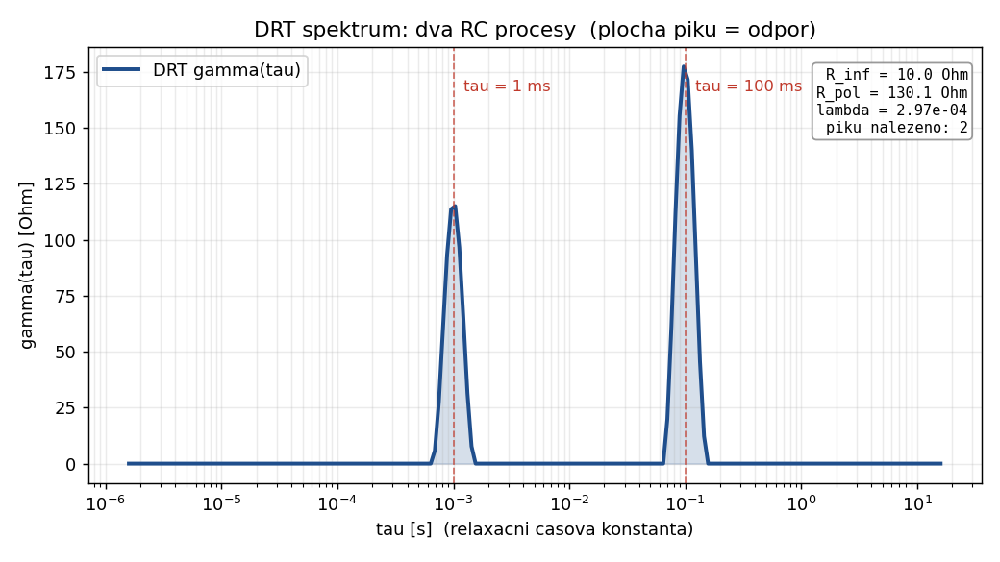

# DRT analyza EIS spekter - intuitivni uvod

Tento dokument vysvetluje **klicove myslenky** analyzy rozlozeni relaxacnich casu
(DRT, Distribution of Relaxation Times) bez zbytecne matematiky. Cilem je, aby ses
po precteni "podival na DRT graf a vedel, co rikas".

Technicke detaily implementace jsou v [DRT_METHOD_ANALYSIS.md](DRT_METHOD_ANALYSIS.md),
volba regularizace v [GCV_IMPLEMENTATION.md](GCV_IMPLEMENTATION.md) a detekce piku v
[GMM_PEAK_DETECTION.md](GMM_PEAK_DETECTION.md).

---

## 1. Problem: ekvivalentni obvody jsou hadani

Klasicky pristup k EIS je fitovat **ekvivalentni obvod** (R, C, CPE, Warburg...).
Funguje to, ale ma to slabinu:

- Musis **predem rozhodnout**, kolik clanku tam je a jak jsou zapojene.
- Ruzne obvody casto fituji stejna data skoro stejne dobre.
- Vysledek je tak dobry, jak dobry byl tvuj odhad struktury.

```
Data  -->  "Asi to bude R(RC)(RC)?"  -->  fit  -->  ladis, kdyz to nesedi
              ^
              tady hadas
```

DRT obraci poradi. Nejdriv se **z dat zepta, kolik procesu tam vlastne je**, a
teprve potom je interpretujes.

---

## 2. Centralni myslenka: kazdy proces ma svuj "cas"

Kazdy elektrochemicky dej probiha s nejakou charakteristickou rychlosti -
**relaxacni casovou konstantou** tau.

```
  Prenos naboje (rychly)      tau ~ ms
  Difuze, adsorpce            tau ~ s
  Pomale procesy v oxidu      tau ~ desitky s
```

Idealni jednoduchy proces = jeden RC clanek = jedna casova konstanta:

```
        tau = R * C
```

DRT rika: **realny vzorek neni jedna casova konstanta, ale jejich rozlozeni.**
Misto jednoho ostreho tau mas spojitou funkci gamma(tau), ktera rika "kolik
odporu" pripada na ktery casovy meritko.

```
gamma(tau)
   |
   |        ___                    Dva procesy:
   |       /   \         _         - ostry pik   = skoro idealni RC
   |      /     \      _/ \_       - siroky pik  = rozmazany (CPE-like)
   |     /       \    /     \
   +----+---------+--+-------+----> log(tau)
       rychly        pomaly
```

**Plocha pod pikem = odpor toho procesu.** Poloha piku = jeho casova konstanta.
To je cela interpretace DRT v jedne vete.

Takhle vypada skutecne DRT spektrum spocitane timto nastrojem. Synteticka data
obsahuji dva RC procesy (tau = 1 ms a tau = 100 ms); DRT je nasla automaticky bez
toho, ze bychom predem rekli, kolik jich tam je:



Vsimni si, ze plocha pod obema piky dohromady dava R_pol = 130 Ohm, coz presne
odpovida souctu odporu obou clanku (50 + 80 Ohm) - tedy "plocha = odpor" plati i
ciselne.

---

## 3. Most mezi daty a DRT: jadro (kernel)

Jak souvisi gamma(tau) s namerenou impedanci Z(omega)? Pres jednoduchy soucet
prispevku vsech casovych konstant:

```
                       inf
  Z(omega) - R_inf  =   |   gamma(tau)
                        |  ------------  d ln(tau)
                        |  1 + j*omega*tau
                      -inf
```

Intuitivne: kazdy nekonecne uzky "platek" rozlozeni se chova jako maly RC clanek
s prenosem `1 / (1 + j*omega*tau)`, a Z je jejich soucet. `R_inf` je odpor
elektrolytu (vysokofrekvencni limit), ktery se odecte zvlast.

V kodu se integral diskretizuje na mrizku tau (obdelnikove pravidlo), takze vznikne
linearni system `A * gamma = b`:

```
  A_re = d_ln_tau / (1 + (omega*tau)^2)            (realna cast)
  A_im = -omega*tau * d_ln_tau / (1 + (omega*tau)^2)   (imaginarni cast)
```

Mrizka tau se voli prirozene podle frekvencniho rozsahu mereni:

```
  tau_min = 1 / (2*pi*f_max)        (nejrychlejsi co jeste "vidis")
  tau_max = 1 / (2*pi*f_min)        (nejpomalejsi co jeste "vidis")
```

Mimo tento rozsah ti data nic nerikaji - proto tam DRT nemuze nic spolehlive tvrdit.

---

## 4. Proc to neni jen "vydeleni": inverzni uloha je krehka

Mohlo by se zdat, ze staci vyresit `A * gamma = b`. Problem: tahle uloha je
**spatne podminena (ill-posed)**. Maly sum v datech zpusobi obrovske skoky v gamma.

```
  Bez regularizace:               gamma
                                    |   /\    /\
  maly sum v Z  ----------->        |  /  \  /  \  /\     <- divoke oscilace,
                                    | /    \/    \/  \       fyzikalne nesmysl
                                    +-------------------> log(tau)
```

Dva sousedni platky tau jsou si tak podobne, ze data nedokazi rozhodnout, kolik
patri kteremu - a reseni "uleti".

---

## 5. Lek: regularizace (hladkost jako predpoklad)

Pridame pozadavek: **fyzikalni rozlozeni je hladke, ne pilovite.** Resime proto
kompromis mezi dvema cili:

```
  minimalizuj:   || A*gamma - b ||^2   +   lambda * || L*gamma ||^2
                 \_________________/        \_______________/
                  sedi to na data?           je to hladke?
```

- `L` je operator **druhe derivace** - mala hodnota = hladka krivka.
- `lambda` ridi vahu hladkosti:

```
  lambda male  -->  verim datum, krivka kostrbata (riskuju overfit, sum)
  lambda velke -->  vnucuji hladkost, krivka rozmazana (riskuju, ze ztratim pik)
```

Navic se vynucuje **gamma >= 0** (zaporny odpor nedava smysl) - reseni se hleda
algoritmem NNLS (non-negative least squares).

Spravne `lambda` je to nejtezsi rozhodnuti. Proto ho kod vybira automaticky pres
**GCV / L-curve** (viz [GCV_IMPLEMENTATION.md](GCV_IMPLEMENTATION.md)) - hleda bod,
kde pridavani hladkosti uz prestava zlepsovat fit. Cilem je nemuset `lambda` ladit
rucne.

---

## 6. Cteni vysledku

Kdyz mas gamma(tau), ctes z neho tohle:

| Co vidis | Co to znamena |
|----------|---------------|
| Poloha piku (tau) | Casova konstanta procesu; `f = 1/tau` |
| Plocha pod pikem | Odpor procesu R_i |
| Pocet piku | Pocet rozlisitelnych procesu |
| Uzky pik (sigma ~ 0.2 dekad) | Skoro idealni RC, jedna tau |
| Siroky pik (sigma > 0.5 dekad) | Distribuovany proces (CPE), vice tau |

Celkovy polarizacni odpor je proste plocha pod celou krivkou (stejna kvadratura
jako v jadru, aby to bylo konzistentni):

```
  R_pol = suma(gamma) * d_ln_tau
```

### Detekce piku

"Pik" se nehleda okem. Kod nabizi dve metody:

- **scipy** - klasicke hledani lokalnich maxim (rychle, jednoduche).
- **GMM** - prolozeni smesi Gaussianu v log(tau) prostoru, pricemz pocet piku
  urci Bayesovsky (BIC). Robustnejsi vuci sumu a prekryvum.
  Viz [GMM_BAYESIAN_INTUITION.md](GMM_BAYESIAN_INTUITION.md).

---

## 7. DRT vs ekvivalentni obvod - kdy co

DRT **nenahrazuje** fitovani obvodu, doplnuje ho:

```
   DRT                              Ekvivalentni obvod
   ----                            -------------------
   "Kolik procesu tam je           "Jake jsou presne hodnoty
    a kde lezi?"                     R, C, CPE techto procesu?"

   Bez predpokladu o strukture     Vyzaduje znat strukturu
   Objektivni, data-driven         Zalozen na modelu
   Da pocet a polohy piku   --->   ... ktere pouzijes jako
                                       pocatecni odhad obvodu
```

Typicky workflow: **DRT nejdriv** (kolik clanku a kde), **obvod potom** (presne
parametry). DRT ti rekne, ze tam jsou napr. dva RC clanky pri 1 ms a 100 ms, a ty
pak fitujes `R(RC)(RC)` s rozumnym pocatecnim odhadem misto hadani.

---

## 8. Na co si dat pozor (limity)

- **Frekvencni rozsah je strop i podlaha.** DRT nevidi procesy mimo namerene
  frekvence. Sirsi mereni = vic informace.
- **Sum se sire pretavi v artefakty.** Maly pik na okraji muze byt jen sum -
  proto regularizace a robustni detekce piku.
- **Volba lambda je kompromis.** Prilis hladke = slije dva piky v jeden. Prilis
  ostre = rozpadne se na falesne picky. Automatika pomaha, ale vysledek je dobre
  zkontrolovat (rekonstrukci Z, residua).
- **Pik neni vzdy jeden proces.** Dva procesy s blizkymi tau se mohou jevit jako
  jeden siroky pik.

---

## Shrnuti v jedne myslence

> DRT premeni EIS spektrum na graf "kolik odporu pripada na ktery casovy meritko".
> Misto hadani struktury obvodu se nejdriv zeptas dat, **kolik procesu tam je a kde
> lezi** - a tahle odpoved je objektivni, protoze vznika z dat, ne z predpokladu.

```
   Namerene Z(omega)
        |
        |  jadro (kazda tau = maly RC clanek)
        v
   inverzni uloha   --(regularizace + NNLS)-->   hladke gamma >= 0
        |
        v
   gamma(tau):  piky = procesy,  plocha = odpor,  poloha = casova konstanta
        |
        v
   interpretace + (volitelne) fit ekvivalentniho obvodu
```

---

## Souvisejici dokumentace

- [DRT_METHOD_ANALYSIS.md](DRT_METHOD_ANALYSIS.md) - detailni rozbor metody a implementace
- [GCV_IMPLEMENTATION.md](GCV_IMPLEMENTATION.md) - automaticka volba lambda
- [GMM_PEAK_DETECTION.md](GMM_PEAK_DETECTION.md) - detekce piku smesi Gaussianu
- [GMM_BAYESIAN_INTUITION.md](GMM_BAYESIAN_INTUITION.md) - intuice za BIC a poctem piku
- [K_ELEMENT_GUIDE.md](K_ELEMENT_GUIDE.md) - Voigt/K-element pohled na casove konstanty
